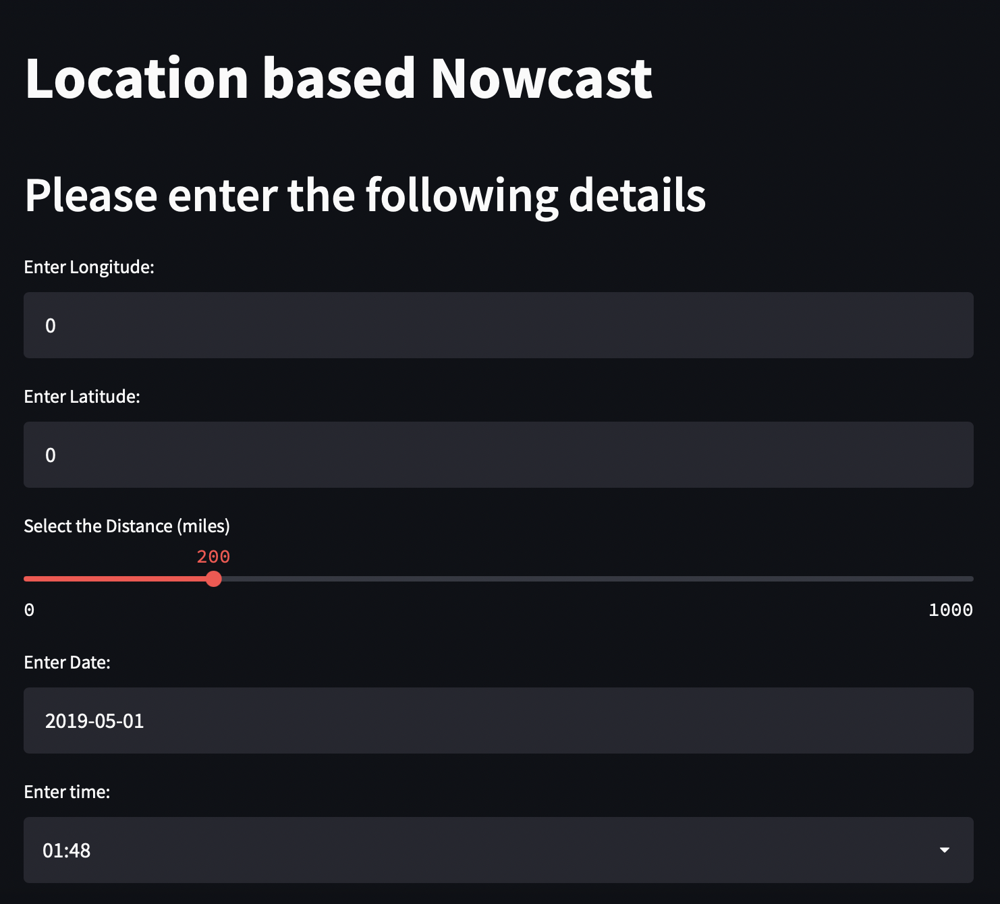
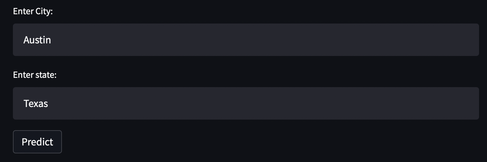

Assignment 4-Part 1
==============================

Introduction
==============================
As part of the fourth assignment of DAMG 7245 we had to check if the entered longitude and latitude fall within a range of certain miles of the nearest longitude and latitude for a matching event id in our Nowcasting system. Write a function accordingly and display the nearest storm details. 

Nowcasting system
==============================
* [Nowcasts](https://en.wikipedia.org/wiki/Nowcasting_(meteorology)) are short-term forecast of weather variables typically measured by weather radar or satellite.   Nowcasts are different from traditional weather forecasts in that they are based (mostly) on statistical extrapolations of recent data, rather than full physics-based numerical weather prediction (NWP) models.  
* Nowcast are computed in a variety of ways, but one of the most common approaches is to apply optical flow techniques to a sequence of radar images.   These techniques track the motion of storm objects, which is then used to extrapolate the location of storms into the future.  

Procedure
==============================

Heroku
==============================
* Heroku is a container-based cloud Platform as a Service (PaaS). Developers use Heroku to deploy, manage, and scale modern apps. Our platform is elegant, flexible, and easy to use, offering developers the simplest path to getting their apps to market.

Web Application - Location based Nowcasting
=============================================

In this Application, we are generating the predicted images using the nowcast model by calling an API. As you can see below the application asks the user to input Latitude & Longitude along with the distance based on how far they want to see the storm prediction view the predicted images along with City, State, Date, and Time. Post giving the input we can generate the images using the nowcast model by invoking the API.

Requirements
==============================
* Python 3.7
* Jupyter Notebooks
* Google Cloud Account
* Heroku
* Streamlit
* Postman

Project Organization
------------

    ├── LICENSE
    ├── Makefile           <- Makefile with commands like `make data` or `make train`
    ├── README.md          <- The top-level README for developers using this project.
    ├── data
    │   ├── external       <- Data from third party sources.
    │   ├── interim        <- Intermediate data that has been transformed.
    │   ├── processed      <- The final, canonical data sets for modeling.
    │   └── raw            <- The original, immutable data dump.
    │
    ├── docs               <- A default Sphinx project; see sphinx-doc.org for details
    │
    ├── models             <- Trained and serialized models, model predictions, or model summaries
    │
    ├── notebooks          <- Jupyter notebooks. Naming convention is a number (for ordering),
    │                         the creator's initials, and a short `-` delimited description, e.g.
    │                         `1.0-jqp-initial-data-exploration`.
    │
    ├── references         <- Data dictionaries, manuals, and all other explanatory materials.
    │
    ├── reports            <- Generated analysis as HTML, PDF, LaTeX, etc.
    │   └── figures        <- Generated graphics and figures to be used in reporting
    │
    ├── requirements.txt   <- The requirements file for reproducing the analysis environment, e.g.
    │                         generated with `pip freeze > requirements.txt`
    │
    ├── setup.py           <- makes project pip installable (pip install -e .) so src can be imported
    ├── src                <- Source code for use in this project.
    │   ├── __init__.py    <- Makes src a Python module
    │   │
    │   ├── data           <- Scripts to download or generate data
    │   │   └── make_dataset.py
    │   │
    │   ├── features       <- Scripts to turn raw data into features for modeling
    │   │   └── build_features.py
    │   │
    │   ├── models         <- Scripts to train models and then use trained models to make
    │   │   │                 predictions
    │   │   ├── predict_model.py
    │   │   └── train_model.py
    │   │
    │   └── visualization  <- Scripts to create exploratory and results oriented visualizations
    │       └── visualize.py
    │
    └── tox.ini            <- tox file with settings for running tox; see tox.readthedocs.io

--------

<small>Project based on the <a target="_blank" href="https://drivendata.github.io/cookiecutter-data-science/">cookiecutter data science project template</a>. #cookiecutterdatascience</small>

